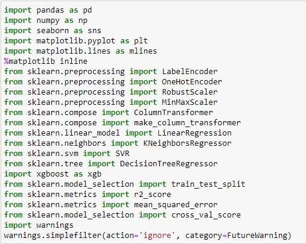

<h1>Prediction of Price of Used Cars</h1>
<h3>This project will predict the prices of used cars using different Machine Learning Algorithms.</h3> 
This project uses the main python modules such as numpy,pandas,matplotlib,sklearn etc..

