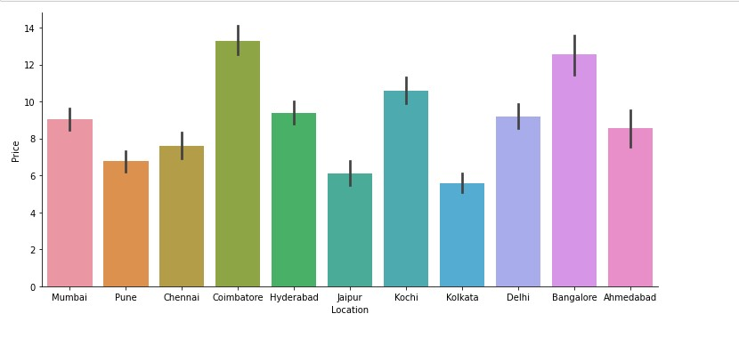

<h1>Prediction of Price of Used Cars</h1>
<h3>This project will predict the prices of used cars using different Machine Learning Algorithms.</h3> 
This project uses the main python modules such as numpy, pandas, matplotlib, sklearn etc.. 
 
The Exploratory data analysis has been done on the data set and then the dataset is visualised. 
 
Finally the predictions are done based on the different algorithms used and it was found out that xgboost gave the maximum accuracy  of 92.06%.
